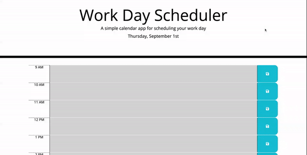

# Work-Scheduler

## Description

The purpose of this project was to build a simple calendar app for scheduling your work day. While completing this project I further expanded my knowledge of Javascript,
HTML, Jquery, and Bootstrap.

## Application
Click [here](https://parkerlacey.github.io/Work-Scheduler/) to go the website.

## Usage

   
   
## Code
* HTML
* CSS
* Javascript
* Jquery
* Bootstrap
* Moment.js

